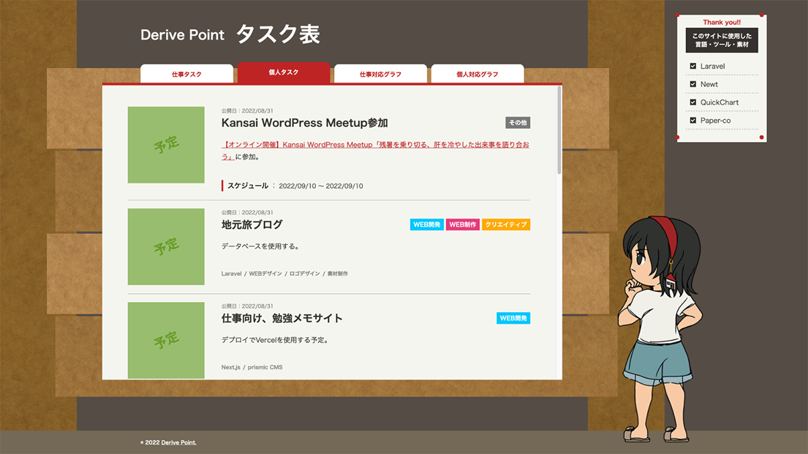

# 仕事用タスク表サイト

仕事向けの案件[^1]・個人タスクを公開しているサイトになります。

[^1]: 詳細内容は公表していません。

## 概要

使用言語・ツール：Laravel / Newt / QuickChart

*** 

入力内容はNewtで管理し、LaravelからAPIを処理しています。

QuickChartを使って、APIの値を元にLaravel側から画像を生成しています。

QuickChartにはPHPのマニュアルしか載っていなかったのもあり躓く部分は多かったのですが、最終的には想定通りに処理できました。

画像生成処理の負荷が大きいこともありスケジュール管理しています。サーバー側のcronを使って、毎朝9時に実行するよう指定しています。

## 履歴

Releasesを確認ください。